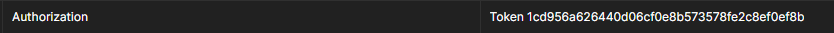

# M7011E-Backend
This is the (user) backend service component of the [microservice-system](github.com/WeRiano/M7011E) created for the course M7011E at
Luleå Tekniska Universitet. 

# How it works

This service stores users in a database. 

A user is defined by the following information/fields:

* `admin` - A boolean which describes if the user is defined as a superuser or not.
* `id` - A integer which serves as a unique identifier between different users.
* `email` - The users email address.
* `password` - The users password as a sha256 hash.
* `date_joined` - The date and time when the user was created.
* `last_login` - The date and time when the user last created an authorization token through the 
[`token/login`](#post-tokenlogin) endpoint.
* `house_img` - A local url to an image file that serves as the users profile picture.
* `first_name` - The users name.
* `last_name` - The users surname.
* `address` - The users address of residence which is defined as a name followed by an integer. 
For example: Slottsbacken 4.
* `city` - The users city of residence. For example: Stockholm.
* `zip_code` - The users zip code which must be an integer on the interval `[10000, 99000)`.

A user can be created, edited and deleted through the [REST API](#api-documentation).

For installation instructions and more, see the [README](https://github.com/WeRiano/M7011E/blob/main/README.md) 
of the overall system.

# API Documentation

All HTTP endpoints are located under the following base url:

`<service_ip>:<service_port>/api/`. 

You must then specify which version of the API that you intend to use by appending `version/<version_nr>/` 
to the base url.

All endpoints return a response in JSON format.

## `api/version/1/`

### Authorization Token

Several endpoint described below requires an authorization token. The token has to be provided as an `Authorization` 
HTTP header in the following format:

`Token <hash>`

Below is an example screenshot from Postman

### POST `token/login/`

#### Parameters

A JSON body with the fields `email` and `password` which must match a user email and password in the service database.
The password does not need to be hashed manually but is done so by the service.

#### Result

Creates and returns an authorization token under the key `auth_token` in the JSON response. 
Also updates the `last_login` field for the given user in the database.

### POST `token/logout/`

#### Parameters

An HTTP [`Authorization`](#authorization-token) header which can be acquired from the 
[`token/login/`](#post-tokenlogin) endpoint.

#### Result

Removes and invalidates the current active user authentication token.

### POST `users/`

#### Parameters

A JSON body with the following fields:

* `email`
* `first_name`
* `last_name`
* `address`
* `city`
* `zip_code`
* `password`
* `re_password`

#### Result

Creates a new user in the service database with the provided information.

### GET `users/get_profile/`

#### Parameters

An HTTP [`Authorization`](#authorization-token) header which can be acquired from the 
[`token/login/`](#post-tokenlogin) endpoint.

#### Result

Returns the following information about the user:

* `admin`
* `id`
* `email`
* `first_name`
* `last_name`
* `address`
* `city`
* `zip_code`

### POST `users/set_password/`

#### Parameters

An HTTP [`Authorization`](#authorization-token) header which can be acquired from the 
[`token/login/`](#post-tokenlogin) endpoint.

A JSON body with the fields `new_passwrd`, `re_new_password` and `current_password`.  
`new_passwrd` and `re_new_password` must match each other while `current_password` must match the current (hashed) 
user password stored in the service database.
The passwords do not need to manually be hashed but is done so by the service.

#### Result

Changes the user password to the hash of `new_password` (and `re_new_password`).

### GET `users/get_image/`

#### Parameters

An HTTP [`Authorization`](#authorization-token) header which can be acquired from the 
[`token/login/`](#post-tokenlogin) endpoint.

#### Result

Returns the users profile picture as byte stream.

### POST `users/update_image/`

#### Parameters

An HTTP [`Authorization`](#authorization-token) header which can be acquired from the 
[`token/login/`](#post-tokenlogin) endpoint.

A JSON body with the following fields: 

* `file` - A string containing the base64 encoding of the image. 
The image data must contain a leading comma.
* `type` - A string containing a 
[supported image format](https://developer.mozilla.org/en-US/docs/Web/Media/Formats/Image_types). 
For example: png. 

#### Result

Deletes the users current profile picture and replaces it with the contents of the `file` parameter.

### PUT `users/update_profile/`

#### Parameters

An HTTP [`Authorization`](#authorization-token) header which can be acquired from the 
[`token/login/`](#post-tokenlogin) endpoint.

A JSON body with the following fields:

* `email`
* `first_name`
* `last_name`
* `address`
* `city`
* `zip_code`

#### Result

Deletes all the fields provided from the JSON body parameter in the service database
and replaces it with the new values.

### GET `admin/get_all_users/`

#### Parameters

An HTTP [`Authorization`](#authorization-token) header which can be acquired from the 
[`token/login/`](#post-tokenlogin) endpoint. This token must belong to a user with an `admin` boolean 
field that equals to `true`.

#### Result

Returns a JSON body with the `users` field. This field consists of a list which contains information 
about each non-admin user stored in the service database. Each element in the list contains the following
fields:

* `admin`
* `id`
* `email`
* `first_name`
* `last_name`
* `address`
* `city`
* `zip_code`

### DELETE `admin/delete_user/<user_id>/`

#### Parameters

An HTTP [`Authorization`](#authorization-token) header which can be acquired from the 
[`token/login/`](#post-tokenlogin) endpoint. This token must belong to a user with an `admin` boolean 
field that equals to `true`.

#### Result

Deletes the user and all its information from the service database including the authorization token
(if there is one). This action can not be undone!